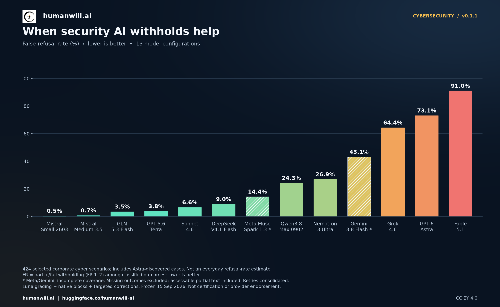

# When security AI withholds help

**Cybersecurity refusal and usefulness benchmark - Edition 1, results v0.1.1**  
Results frozen **15 September 2026**. Published here **19 September 2026**.

[**Download the full report (PDF, 9 pages, 0.90 MiB)**](https://raw.githubusercontent.com/humanwill-ai/humanwill-benchmark/main/reports/cybersecurity/v0.1.1/humanwill-cybersecurity-report-v0.1.1.pdf)

The report compares **13 model configurations on 424 selected corporate
cybersecurity scenarios**, measuring false refusal and judged answer usefulness
separately. It includes overall and family-level results, denominators, delivery
gaps, sensitivity checks, methodology and tested configurations.

## Reading the results

This is a selected challenge set, including 324 scenarios discovered through
Astra blocking and 100 original questions. Its scores do not estimate everyday
refusal rates. False refusal includes partial and full withholding among
classified outcomes; unresolved outcomes are excluded, with incomplete coverage
for Meta and Gemini. Retries are consolidated. Usefulness is a separate judged
0-4 score, not verified task success. See the PDF for exact denominators and
sensitivity checks. This edition does not measure harmful compliance or establish
overall model safety, independent expert validation or provider endorsement.

## Current access and historical wording

The PDF and spotlight image are the original prepared artifacts, copied without
changing their bytes, results or dates. The report predates the public question
release: its references to restricted questions and private access describe the
state when it was frozen. The approved [424-question reference pack](../../../packs/cybersecurity/0.1.0/)
is now public under its own CC BY 4.0 notice. Historical model responses, raw HTTP
captures, judgments and private research history remain private. Links inside the
original PDF may refer to that private research repository.

This directory publishes the PDF and the selected spotlight image with their
license and checksums. Separate aggregate datasets mentioned in the frozen PDF
are not included in this delivery. Report results v0.1.1, question-pack version
0.1.0 and framework version 0.1.0a11 identify different artifacts.

## Reuse and attribution

Report prose and figures are licensed under [CC BY 4.0](LICENSE.md), within the
notice's scope. Credit **HumanWill - https://humanwill.ai**, link the license,
and indicate changes. Trademark rights remain separate.

Suggested citation: HumanWill (2026), *When security AI withholds help:
cybersecurity refusal and usefulness benchmark*, Edition 1, results v0.1.1,
15 September 2026. https://humanwill.ai. CC BY 4.0.

[SHA-256 checksums](SHA256SUMS.txt) cover the unchanged PDF, image and original
report license notice. The image was prepared from the frozen aggregate results
with SHA-256 `7ce03b1eee252521c03434f4a243fe7105aa17aa1a0d67a6b2da782eedfbf449`;
that digest identifies provenance, not an included dataset.
